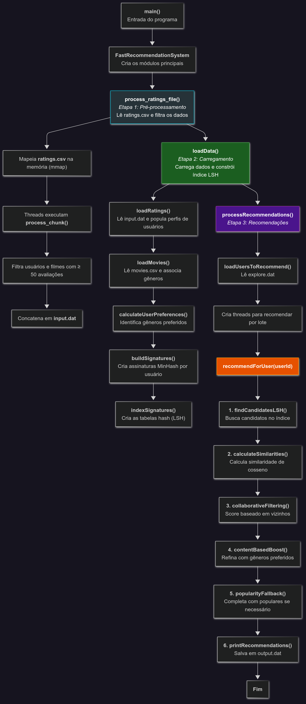

#          🎬 Sistema de Recomendação MovieLens

<div align='center'>

</div>

<p align="center">
  
  
  
  
  
  
  
</p>
<div align='center'>
Algoritmos e Estruturas de Dados I <br>
Engenharia de Computação <br>
Prof. Michel Pires da Silva <br>
CEFET-MG Campus V <br>
2025/1  
</div>

<details>
<summary><h2>📋 Índice</h2></summary>

- [🎬 Sistema de Recomendação MovieLens](#-sistema-de-recomendação-movielens)
  - [📝 Introdução](#introdução)
  - [🎯 Objetivos](#objetivos)
    - [Objetivo Geral](#objetivo-geral)
      - [Métricas de Desempenho](#métricas-de-desempenho)
    - [Objetivos Específicos](#objetivos-específicos)
  - [📚 Fundamentação Teórica](#-fundamentação-teórica)
    - [Sistemas de Recomendação](#sistemas-de-recomendação)
    - [Abordagens de Recomendação](#abordagens-de-recomendação)
      - [Filtragem Colaborativa (Collaborative Filtering - CF)](#filtragem-colaborativa-collaborative-filtering---cf)
      - [Recomendação Baseada em Conteúdo (Content-Based - CB)](#recomendação-baseada-em-conteúdo-content-based---cb)
      - [Sistema Híbrido](#sistema-híbrido)
    - [Similaridade do Cosseno (Cosine Similarity)](#similaridade-do-cosseno-cosine-similarity)
    - [Locality Sensitive Hashing (LSH)](#locality-sensitive-hashing-lsh)
  - [🔬 Modelagem da Aplicação](#-modelagem-da-aplicação)
    - [Fluxo de Execução do Sistema](#fluxo-de-execução-do-sistema)
    - [📊 Estruturas de Dados](#-estruturas-de-dados)
    - [🚀 Otimizações Propostas](#-otimizações-propostas)
      - [Pré-processamento e Carregamento de Dados](#pré-processamento-e-carregamento-de-dados)
      - [Otimizações no LSH e Busca de Similares](#otimizações-no-lsh-e-busca-de-similares)
      - [Otimizações na Geração de Recomendações](#otimizações-na-geração-de-recomendações)
  - [📝 Metodologia](#-metodologia)
    - [📁 Arquivos](#arquivos)
    - [📚 Bibliotecas](#-bibliotecas)
    - [⚙️ Definições e Estruturas Usadas](#️-definições-e-estruturas-usadas)
      - [Constantes Globais (Definidas em `Config.hpp`)](#constantes-globais-definidas-em-confighpp)
      - [Estruturas de Dados (Definidas em `DataStructures.hpp` e outras classes)](#estruturas-de-dados-definidas-em-datastructureshpp-e-outras-classes)
    - [📝 Funções Implementadas](#-funções-implementadas)
      - [`main.cpp`](#maincpp)
      - [`preProcessament.cpp`](#preprocessamentcpp)
      - [`DataLoader.cpp`](#dataloadercpp)
      - [`LSHIndex.cpp`](#lshindexcpp)
      - [`SimilarityCalculator.cpp`](#similaritycalculatorcpp)
      - [`RecommendationEngine.cpp`](#recommendationenginecpp)
      - [`FastRecommendationSystem.cpp`](#fastrecommendationsystemcpp)
  - [🏁 Conclusão](#-conclusão)
  - [🔧 Configuração do Ambiente](#configuração-do-ambiente)
  - [💻 Como Compilar e Executar](#-como-compilar-e-executar)
    - [Clone o Repositório](#clone-o-repositório)
    - [Pré-requisitos](#pré-requisitos)
    - [Compilação](#compilação)
    - [Execução](#execução)
  - [👥 Equipe de Desenvolvimento](#-equipe-de-desenvolvimento)
    - [🚀 Nossos Desenvolvedores](#-nossos-desenvolvedores)
    - [📊 Estatísticas da Equipe](#-estatísticas-da-equipe)
    - [🤝 Sobre Nossa Colaboração](#-sobre-nossa-colaboração)
      - [🎯 Nossos Valores](#-nossos-valores)

</details>


## 📝Introdução

Este trabalho foi desenvolvido como parte da disciplina de Algoritmos e Estruturas de Dados I (AESD1), sob a orientação do professor [Michel Pires Silva](https://github.com/mpiress). Nosso objetivo principal é o desenvolvimento e otimização de um sistema de recomendação capaz de sugerir agrupamentos de elementos similares, utilizando perfis de usuários e características dos itens.

Inspirando-nos em conceitos de algoritmos de classificação e similares, este projeto aprofunda-se em técnicas para melhorar a eficácia e a eficiência computacional de sistemas de recomendação. A ideia é um modelo de "treino e teste" tradicional para classificação de bases de dados categorizadas, aplicando uma abordagem de filtragem colaborativa e baseada em conteúdo, priorizando critérios de buscas de vizinhos próximos.

Para este estudo, utilizamos a vasta base de dados:
**[MovieLens 25M Dataset](https://www.kaggle.com/datasets/garymk/movielens-25m-dataset)**. 

Este dataset é amplamente reconhecido na área de sistemas de recomendação e contém um grande volume de avaliações de filmes por usuários, além de metadados sobre os filmes. O arquivo principal utilizado é o `ratings.csv` e o `movies.csv`, mas outras informações complementares foram exploradas para enriquecer as recomendações.

O pré-processamento dos dados seguiu critérios específicos para garantir a qualidade da entrada:

- Foram considerados apenas usuários que realizaram pelo menos 50 avaliações distintas.
- Apenas filmes avaliados por no mínimo 50 usuários foram incluídos.
- Registros duplicados ou inconsistentes foram removidos.

O arquivo de entrada (`input.dat`) foi gerado no formato:
`usuário_id item_id1:nota1 item_id2:nota2 ...`

Nosso sistema de recomendação integra uma combinação de abordagens para gerar sugestões personalizadas:

- **Filtragem Colaborativa (CF):** Baseia-se na similaridade entre usuários.
- **Recomendação Baseada em Conteúdo (CB):** Aproveita as características dos filmes e as preferências dos usuários.
- **Popularidade:** Um componente de popularidade foi integrado para impulsionar itens bem avaliados e populares.

Para otimizar a busca por usuários similares, implementamos a técnica de **Locality Sensitive Hashing (LSH)**. A integração do LSH, juntamente com a otimização dos parâmetros e implementação de estratégias de fallback, visam garantir a robustez e a qualidade das recomendações, mesmo em cenários de escassez de dados.

O objetivo final é gerar as K melhores recomendações para cada `usuario_id` presente no arquivo `explore.dat`, armazenando os resultados no arquivo `output.dat`.

O desempenho do algoritmo será avaliado por critérios como tempo de execução, qualidade das recomendações e consumo de memória. Com o desenvolvimento do programa, buscamos meios de otimizar o processo, aprimorando tanto a acurácia das recomendações quanto a eficiência na classificação da base de dados.

## 🎯Objetivos

### Objetivo Geral

O objetivo geral deste trabalho é desenvolver e otimizar um sistema de recomendação robusto e eficiente, utilizando a base de dados MovieLens 25M, focado em entregar recomendações de alta qualidade em tempo hábil. Busca-se aprimorar a precisão das recomendações e a eficiência computacional, com ênfase na fase de geração de recomendações, visando reduzir o tempo de execução e aumentar a relevância das sugestões para os usuários.
#### Métricas de Desempenho

A avaliação do nosso sistema de recomendação é realizada com base nos seguintes critérios, conforme as diretrizes do trabalho:
* **Tempo de Execução:** Menor tempo médio de execução, medido em segundos, para todo o processo de recomendação, com um limite de 2.5 segundos por recomendação/usuário.
* **Qualidade da Recomendação:** Avaliação da cobertura (diversidade de recomendações) e precisão (relevância das recomendações).
* **Consumo de Memória:** Avaliado através de medições para garantir a eficiência do uso de recursos.

### Objetivos Específicos

- **Pré-processar a base de dados MovieLens 25M:**  
  Desenvolver um módulo de pré-processamento para filtrar usuários com menos de 50 avaliações e filmes avaliados por menos de 50 usuários, gerando um arquivo de entrada padronizado (`input.dat`).

- **Implementar um sistema de recomendação híbrido:**  
  Integrar abordagens de filtragem colaborativa (baseada em similaridade de usuários usando Co-seno), recomendação baseada em conteúdo (utilizando preferências de gênero do usuário) e um componente de popularidade para calcular *scores* de recomendação para filmes não assistidos.

- **Otimizar a busca por usuários similares com LSH:**  
  Implementar e configurar a técnica de Locality Sensitive Hashing (LSH) para acelerar a identificação de usuários similares, ajustando parâmetros como número de funções hash, bandas e tabelas para equilibrar recall e precisão, e explorar técnicas de multi-probe LSH para garantir a diversidade de candidatos.

- **Aprimorar a resiliência do sistema com estratégias de fallback:**  
  Desenvolver e integrar mecanismos de *fallback* para garantir a geração de um número adequado de recomendações mesmo em cenários de poucos vizinhos similares, como preenchimento com filmes populares ou candidatos de similaridade mais baixa.

- **Avaliar o desempenho e a qualidade das recomendações:**  
  Medir o tempo médio de execução por usuário, o consumo de memória e a qualidade das recomendações geradas, buscando atender aos critérios de eficiência computacional e relevância definidos.


## 📚 Fundamentação Teórica

O desenvolvimento de um sistema de recomendação eficiente exige a compreensão e aplicação de diversos conceitos fundamentais da área de sistemas de informação e aprendizado de máquina. Esta seção explora as bases teóricas que sustentam a arquitetura e as otimizações implementadas no presente trabalho.

### Sistemas de Recomendação

Sistemas de recomendação são ferramentas de filtragem de informação que visam prever as preferências de um usuário por um item e sugerir os itens mais relevantes para ele. Eles são amplamente utilizados em plataformas de e-commerce, streaming de mídia e redes sociais para personalizar a experiência do usuário, aumentar o engajamento e impulsionar o consumo de conteúdo. O objetivo principal é ajudar os usuários a descobrir novos itens que eles provavelmente gostarão, superando o problema da sobrecarga de informação.

### Abordagens de Recomendação

No contexto deste projeto, utilizamos uma abordagem híbrida, combinando os pontos fortes de diferentes paradigmas:

#### Filtragem Colaborativa (Collaborative Filtering - CF)

A Filtragem Colaborativa é uma das abordagens mais populares em sistemas de recomendação. Ela opera sob o princípio de que usuários com gostos semelhantes no passado continuarão a ter gostos semelhantes no futuro. Existem duas subcategorias principais:
* **User-Based CF:** Recomenda itens que usuários similares (vizinhos) gostaram no passado. O sistema identifica usuários com perfis de avaliação semelhantes ao do usuário-alvo e usa as avaliações desses vizinhos para prever a preferência do usuário-alvo por itens não vistos. Esta é a abordagem de CF central no nosso sistema.
* **Item-Based CF:** Recomenda itens que são semelhantes aos itens que o usuário gostou no passado.

#### Recomendação Baseada em Conteúdo (Content-Based - CB)

A Filtragem Baseada em Conteúdo sugere itens que são semelhantes aos itens que o usuário demonstrou interesse no passado. Diferentemente da CF, a CB não depende das avaliações de outros usuários, mas sim das características dos próprios itens e do perfil de preferência construído para o usuário. Em nosso sistema, isso é aplicado através da identificação dos gêneros de filmes preferidos pelo usuário e do impulsionamento de filmes desses gêneros.

#### Sistema Híbrido

Sistemas de recomendação híbridos combinam duas ou mais abordagens de recomendação para superar as limitações individuais de cada uma (e.g., o problema do "cold start" ou esparsidade de dados na CF, ou a falta de diversidade na CB). Nosso sistema é híbrido, pois integra o CF (via similaridade de usuários), o CB (via preferências de gênero) e um componente de popularidade, visando uma recomendação mais robusta e completa.

### Similaridade do Cosseno (Cosine Similarity)

A Similaridade do Cosseno é uma métrica comum para medir a semelhança entre dois vetores não-nulos em um espaço de produtos internos. Ela mede o cosseno do ângulo entre os vetores, com valores que variam de -1 (exatamente opostos) a 1 (exatamente iguais), sendo 0 indicativo de ortogonalidade (sem correlação). Em sistemas de recomendação, é frequentemente utilizada para calcular a similaridade entre perfis de usuários ou itens, tratando suas avaliações como vetores em um espaço multidimensional. É particularmente eficaz para dados esparsos, onde nem todos os usuários avaliaram todos os itens.

A fórmula geral da similaridade do cosseno entre dois vetores $A$ e $B$ é:

**$$\cos(\theta) = \frac{A \cdot B}{||A|| \cdot ||B||} = \frac{\sum_{i=1}^{n} A_i B_i}{\sqrt{\sum_{i=1}^{n} A_i^2} \sqrt{\sum_{i=1}^{n} B_i^2}}$$**

Em nosso sistema, $A_i$ e $B_i$ representam as avaliações de dois usuários para um filme $i$ em comum.

### Locality Sensitive Hashing (LSH)

Locality Sensitive Hashing (LSH) é uma técnica probabilística para busca eficiente de vizinhos mais próximos em espaços de alta dimensionalidade. O conceito central é "hashear" itens semelhantes para os mesmos "buckets" com alta probabilidade, enquanto itens diferentes caem em buckets diferentes. Isso permite que a busca por similaridade seja reduzida a uma busca por igualdade de hash.

No contexto de sistemas de recomendação, o LSH é utilizado para:
1.  **Redução de Dimensionalidade (MinHash):** Os conjuntos de itens avaliados por usuários são convertidos em "assinaturas" compactas (MinHash signatures). A similaridade entre as assinaturas (Jaccard Similarity) é uma boa estimativa da similaridade Jaccard entre os conjuntos originais de itens.
2.  **Indexação (Bands e Tables):** Cada assinatura MinHash é dividida em várias "bandas". Múltiplas tabelas hash são criadas, e para cada tabela, as bandas da assinatura são "hasheadas" em um bucket. Se duas assinaturas são semelhantes, é provável que pelo menos uma de suas bandas colida no mesmo bucket em alguma tabela.

A configuração do LSH (número de funções hash, bandas e tabelas) é crucial para equilibrar o *recall* (encontrar todos os similares) e a *precisão* (evitar falsos positivos). Nosso sistema utiliza uma configuração otimizada para maximizar as colisões entre usuários verdadeiramente similares.


## 🔬 Modelagem da Aplicação

Partindo dos objetivos de desenvolver um sistema de recomendação eficiente para a base de dados MovieLens, nossa modelagem buscou equilibrar a qualidade das recomendações com o desempenho computacional. Para isso, adotamos uma arquitetura modular em C++, aproveitando as características da linguagem para processar grandes volumes de dados e otimizar operações críticas. A escolha do C++ foi motivada por seu desempenho, controle de baixo nível e a riqueza de sua Standard Template Library (STL), que oferece estruturas de dados otimizadas e flexíveis.

Nosso sistema de recomendação opera em três etapas principais, conforme visível no `main.cpp`:
1. **Pré-processamento dos Dados:**  
   Nesta etapa, o arquivo `ratings.csv` original do MovieLens 25M é lido, filtrado e convertido para um formato otimizado (`input.dat`). Este passo é crucial para garantir que apenas dados relevantes (usuários e filmes com número mínimo de avaliações) sejam processados e para formatar os dados de maneira eficiente para as etapas subsequentes.

2. **Carregamento de Dados e Construção do Índice LSH:**  
   O sistema lê os dados pré-processados, carrega informações de filmes e, mais importante, constrói o índice de **Localidade Sensível a Hash (LSH)**. Este índice é a base para a rápida identificação de usuários similares.

3. **Processamento das Recomendações:**  
    A etapa final onde as recomendações são geradas para um conjunto de usuários especificados no arquivo `explore.dat`. Este processo envolve a busca por usuários similares, o cálculo de scores de recomendação utilizando abordagens híbridas (colaborativa, baseada em conteúdo e popularidade) e a aplicação de estratégias de fallback.
   
Essa estrutura garante uma separação nítida das responsabilidades, possibilitando otimizações específicas para cada etapa.

### Fluxo de Execução do Sistema

O sistema de recomendação segue uma sequência de etapas bem definidas para carregar os dados, construir o índice de usuários similares e gerar as recomendações. O fluxograma abaixo ilustra esse processo:



**Visão geral do fluxo de dados e processamento no sistema de recomendação.**


### 📊 Estruturas de Dados

A escolha e a implementação eficientes das estruturas de dados são cruciais para o desempenho de um sistema de recomendação que lida com grandes volumes de usuários e itens. Compreendendo as necessidades de armazenamento, acesso rápido e manipulação de dados, utilizamos diversas estruturas da STL do C++:

- `std::unordered_map`: Amplamente utilizada por sua capacidade de fornecer acesso quase constante *O(1)* a elementos. É empregada para:

   - Mapear IDs de usuários para seus `UserProfile` ( `users` ).

   - Mapear IDs de filmes para suas `Movie` informações ( `movies` ).

   - Armazenar a contagem de filmes e suas somas de avaliações (`movieSums`, `movieCounts`, `movieAvgRatings`, `moviePopularity`).

   - Implementar as tabelas do LSH ( `tables` ), onde cada bucket é um vetor de IDs de usuários.

   - Manter um cache de similaridades já calculadas entre pares de usuários ( `cache` em `SimilarityCalculator`).

   - Associar IDs de gêneros a seus nomes ( `genreToId` ).

   - Agrupar usuários por filme ( `movieToUsers` ) para a fase de pré-processamento e busca de candidatos.

- `std::vector`: Utilizada para armazenar coleções dinâmicas de elementos. Sua principal aplicação inclui:

   - Armazenar as avaliações de um usuário ( `UserProfile::ratings` ) como pares (`movieId`, `rating`), que são mantidos ordenados por `movieId` para otimizar operações de interseção.

   - Representar as assinaturas MinHash ( `MinHashSignature::signature` ) para cada usuário.

   - Listar IDs de usuários dentro dos buckets de LSH.

   - Armazenar a lista de filmes para cada gênero (`genreToMovies`).

   - Gerenciar listas de candidatos e usuários similares.
     
- `std::pair`: Essencial para agrupar dois valores relacionados, como (`movieId`, `rating`) em `UserProfile::ratings` ou (`candidateId`, `commonCount`) para candidatos a usuários similares. A ordenação dos pares (`movieId`, `rating`) nos vetores de avaliações (`user.ratings`) é fundamental para otimizar a cálculo de similaridade do cosseno, permitindo um "merge-join" eficiente dos itens em comum entre dois usuários.

- `std::unordered_set`: Empregada onde a presença única de elementos e a busca rápida são prioritárias, como para `watchedMovies` e para `valid_movie`s e `allMovies` durante o pré-processamento e construção do LSH, respectivamente.


### 🚀 Otimizações Propostas

As otimizações implementadas visaram tanto a eficiência do pré-processamento quanto a aceleração das fases de carregamento e recomendação, que são críticas para o desempenho em tempo real. As principais áreas de otimização e as abordagens utilizadas são:

#### Pré-processamento e Carregamento de Dados

1.  **Leitura Otimizada de Arquivos (Memory Mapping e `std::from_chars`)**:
    * **Memory Mapping (`mmap`)**: O arquivo `ratings.csv` é mapeado diretamente para a memória. Isso evita as latências de E/S tradicionais, permitindo que o sistema operacional lide com o carregamento de blocos de dados de forma mais eficiente.
    * **`std::from_chars` (C++17)**: Para o parsing de números (IDs de usuário, filme e ratings) a partir do buffer mapeado, `std::from_chars` é utilizado em vez de `std::stoi` ou `std::stof`. Esta função é significativamente mais rápida porque não aloca memória dinamicamente nem lança exceções, resultando em um parsing de string para número extremamente eficiente.

2.  **Pré-processamento Paralelo:**
    * A fase de contagem de avaliações por usuário e filme (`process_chunk`) é paralelizada utilizando múltiplas threads. Cada thread processa um chunk do arquivo mapeado, gerando contagens locais.
    * A filtragem de usuários (mínimo de 50 avaliações válidas ) e filmes (mínimo de 50 avaliações ) é aplicada, e a escrita do `input.dat` é feita em paralelo para arquivos temporários (`filter_and_write_chunk`).
    * Um processo final de concatenação (`concatenate_temp_files`) une os arquivos temporários no `input.dat` final. Isso distribui a carga de E/S e processamento, acelerando o pré-processamento geral.

3.  **Alinhamento de Dados (`alignas`)**: A estrutura `ThreadData` em `DataLoader.cpp` é marcada com `alignas(64)`. Isso garante que os dados de cada thread sejam alinhados em linhas de cache separadas, mitigando o "falso compartilhamento" (false sharing) e melhorando o desempenho em sistemas multi-core.

#### Otimizações no LSH e Busca de Similares

1.  **Pré-computação de Hashes para Filmes (LSH `buildSignatures`)**:
    * Os hashes de todos os filmes únicos são pré-computados uma única vez e armazenados em um `unordered_map` (`precomputedHashes`). Isso elimina cálculos redundantes durante a construção das assinaturas MinHash para cada usuário.
    * A construção das assinaturas MinHash é paralelizada, com threads computando as assinaturas para diferentes subconjuntos de usuários.

2.  **LSH Menos Rigoroso para Buckets Maiores (Ajuste de Parâmetros)**:
    * O algoritmo LSH foi configurado com parâmetros menos rigorosos para aumentar a probabilidade de usuários similares colidirem no mesmo bucket. Isso resulta em buckets maiores, contendo mais candidatos potenciais:
        * `NUM_BANDS = 24`.
        * `ROWS_PER_BAND = 4`.
        * `NUM_HASH_FUNCTIONS = 96`.
    * O `hashBand` usa um módulo de hash menor (`% 20000`) para limitar o espaço de hash, promovendo a criação de buckets mais densos.
    * A fase de indexação no LSH (`indexSignatures`) foi ajustada para usar um número menor de bandas por tabela (`BANDS_PER_TABLE = 3`) para criar buckets mais robustos.

3.  **Multi-Probe LSH (Fallback na Busca de Candidatos)**:
    * No `findSimilarCandidates`, se o número de candidatos iniciais for baixo, o sistema tenta buscar em buckets "vizinhos" aplicando pequenas perturbações aos hashes das bandas (`multi-probe LSH`). Isso aumenta as chances de encontrar mais vizinhos quando o match inicial não é suficiente.

4.  **Candidatos de Similaridade Média (Fallback de `findCandidateUsersLSH`)**:
    * A função `findCandidateUsersLSH` foi modificada para, após obter uma lista inicial de candidatos via LSH, filtrar e priorizar aqueles com alta contagem de itens em comum. Se a lista de "alta qualidade" for muito pequena (`< 20` candidatos), o sistema preenche a lista com os melhores candidatos da lista *completa* de achados pelo LSH, garantindo um número mínimo de candidatos para a Filtragem Colaborativa.

#### Otimizações na Geração de Recomendações

1.  **Cache de Similaridade (`SimilarityCalculator`)**:
    * Para evitar o recálculo redundante da similaridade entre pares de usuários, um `std::unordered_map` (`cache`) é utilizado em `SimilarityCalculator` para armazenar os resultados de similaridades já computadas. Antes de calcular a similaridade do cosseno, o cache é consultado, resultando em um acesso $O(1)$ na maioria dos casos.

2.  **Cálculo de Similaridade do Cosseno Otimizado**:
    * A similaridade do cosseno (`calculateCosineSimilarity`) é utilizada, sendo eficaz para dados esparsos.
    * A interseção de filmes avaliados em comum entre dois usuários é feita de forma eficiente, iterando sobre os vetores de avaliações (`user.ratings`) que são **mantidos ordenados por `movieId`**. Isso permite uma abordagem de "merge-join" linear $O(N_1 + N_2)$ para encontrar itens em comum.

3.  **Paralelização das Recomendações por Usuário (`processRecommendations`)**:
    * A fase de geração de recomendações para cada usuário no `explore.dat` é paralelizada. Múltiplas threads processam lotes de usuários simultaneamente (`BATCH_SIZE`), onde cada thread chama `recommendForUser` para um subconjunto de IDs de usuários.
    * Um `std::mutex` (`fileMutex`) é usado para proteger a escrita nos arquivos de saída (`output.dat` e `debug_recommendations.txt`) para evitar condições de corrida.

4.  **Ajustes de Parâmetros de Recomendação (Configurações Otimizadas)**:
    * `MIN_COMMON_ITEMS = 1`: Reduzido para aceitar usuários com apenas 1 filme em comum, aumentando o pool de candidatos similares.
    * `MIN_SIMILARITY = 0.01f`: Muito mais permissivo, aceitando similaridades muito baixas para aumentar a chance de encontrar vizinhos.
    * `MAX_CANDIDATES = 1000`: Aumentado para fornecer mais material para o algoritmo trabalhar.
    * Pesos Otimizados para o Sistema Híbrido: `CF_WEIGHT` e `CB_WEIGHT` ajustados, com a introdução de um `POPULARITY_WEIGHT = 3.0f` para impulsionar a relevância da popularidade.
    * `POPULARITY_BOOST_WEIGHT = 1.5f`: Novo peso para impulsionar a popularidade em cenários de fallback.


## 📝 Metodologia

As abordagens propostas para otimizar o sistema de recomendação MovieLens foram implementadas em C++, utilizando a IDE Visual Studio Code para o desenvolvimento do código-fonte. O projeto foi organizado em um diretório principal, contendo subdiretórios para armazenar os arquivos de código-fonte, os datasets utilizados (`ml-25m/`, `datasets/`) e os arquivos de saída (`outcome/`).

A implementação do sistema de recomendação foi estruturada em etapas distintas, conforme detalhado na Modelagem da Aplicação: um **pré-processamento** dos dados brutos, um **carregamento dos dados e construção do índice LSH** (que pode ser considerado o "treinamento" do modelo de vizinhança), e a **fase de recomendação**, onde o sistema gera sugestões personalizadas para usuários específicos. Durante a fase de carregamento e construção do índice LSH, o sistema mapeia as avaliações de usuários e filmes, construindo estruturas de dados eficientes para representá-los e para permitir a busca rápida por usuários similares. Na fase de recomendação, o sistema classifica e ranqueia filmes para o usuário-alvo, utilizando uma combinação de técnicas como filtragem colaborativa, conteúdo e popularidade para determinar as melhores sugestões.

### 📁Arquivos

Para a implementação do sistema de recomendação MovieLens, o projeto foi organizado em um diretório principal, contendo subdiretórios para armazenar os arquivos de código-fonte, os datasets utilizados e os arquivos de saída. 
A seguir, a estrutura do diretório do projeto:
```
.
├── Makefile
├── README.md
├── datasets/
│   ├── input.dat
│   └── explore.dat
├──outcome/
|   └──output.dat
├── ml-25m/
│   └── arquivos MovieLens (como ratings.csv, movies.csv, etc.)
└── src/
    ├── Config.hpp                
    ├── DataLoader.cpp
    ├── DataLoader.hpp
    ├── DataStructures.hpp        
    ├── FastRecommendation.cpp    
    ├── FastRecommendation.hpp
    ├── LSHIndex.cpp              
    ├── LSHIndex.hpp
    ├── Main.cpp                 
    ├── preProcessament.cpp       
    ├── preProcessament.hpp       
    ├── RecommendationEngine.cpp        
    ├── RecommendationEngine.hpp
    ├── SimilarityCalculator.cpp  
    └── SimilarityCalculator.hpp

```
- `.`: Diretório raiz do projeto.

- `Makefile`: Script para compilação e execução do projeto.

- `README.md`: Este arquivo de documentação.

- `datasets/`: Diretório para armazenar os dados de entrada processados para o sistema.

    - `input.dat`: Base de dados pré-processada no formato `usuario_id item_id1:nota1 ...`, utilizada como fonte de dados para o algoritmo de recomendação.

    - `explore.dat`: Lista de `usuario_ids` para os quais as recomendações personalizadas serão geradas.

- `outcome/`:Diretório para armazenar os resultados.

    - `output.dat`: Arquivo de saída contendo as K recomendações para cada usuário listado em `explore.dat`, no formato `usuario_id item_id1 item_id2 ...`.

- `ml-25m/`: Diretório que contém os arquivos brutos originais da base de dados MovieLens 25M, baixados diretamente do Kaggle.

    - `ratings.csv`: O arquivo principal com as avaliações dos usuários.

    - `movies.csv, tags.csv, etc.`: Outros arquivos que podem ser explorados para dados adicionais durante o pré-processamento.

- `src/`: Contém todos os arquivos de código-fonte modularizados (implementações .cpp e cabeçalhos .hpp).

    - `Config.hpp`: Define constantes globais e parâmetros de configuração do sistema (ex: `TOP_N_RECOMMENDATIONS`).

    - `DataLoader.cpp/.hpp`: Responsável pelo carregamento dos dados de `input.dat` para estruturas de dados em memória e pelo gerenciamento desses dados.

    - `DataStructures.hpp`: Contém as definições das estruturas de dados customizadas utilizadas no projeto (ex: structs para usuários, itens, nós de listas ou árvores, etc.).

    - `FastRecommendation.cpp/.hpp`: Este módulo abriga uma abordagem otimizada ou um método específico de recomendação desenvolvido para acelerar o processo.

    - `LSHIndex.cpp/.hpp`: Contém a implementação de Locality Sensitive Hashing (LSH), uma técnica de indexação para otimização da busca por vizinhos similares em grandes conjuntos de dados. Confirme se LSH foi realmente utilizado.

    - `Main.cpp`: O ponto de entrada principal do programa, que orquestra as chamadas para as diferentes fases do sistema (pré-processamento, carregamento, recomendação, gravação de saída).

    - `preProcessament.cpp/.hpp`: Contém as funções responsáveis pelo processamento inicial da base de dados bruta (`ml-25m/ratings.csv e outros`), incluindo filtragem de usuários/filmes, remoção de duplicatas e geração do `input.dat`.

    - `RecommendationEngine.cpp/.hpp`: Abriga a lógica central do algoritmo de recomendação, gerenciando a busca por vizinhos, a agregação de recomendações e a priorização dos filmes a serem sugeridos.

    - `SimilarityCalculator.cpp/.hpp`: Implementa as métricas de similaridade (Euclidiana, Cosseno, Jaccard) utilizadas para quantificar a afinidade entre usuários.
      
### 📚 Bibliotecas

A implementação do sistema de recomendação MovieLens faz uso extensivo da Standard Template Library (STL) do C++ e de bibliotecas para operações de sistema de baixo nível, visando alta performance e modularidade. As principais bibliotecas utilizadas são:

* **Bibliotecas do Projeto (Headers Customizados):**
    * `Config.hpp`: Define constantes e parâmetros globais do sistema, como o número de recomendações (TOP-K), limites de similaridade, parâmetros do LSH, e pesos para o sistema híbrido.
    * `DataStructures.hpp`: Contém as definições das estruturas de dados personalizadas, como `UserProfile`, `Movie`, `Rating`, `Recommendation`, `MinHashSignature` e `BandHashParams`.
    * `DataLoader.hpp`: Define a interface para o módulo responsável pelo carregamento e pré-processamento dos dados, incluindo filmes e avaliações.
    * `LSHIndex.hpp`: Contém a implementação do índice de Localidade Sensível a Hash (LSH) para a busca eficiente de usuários similares.
    * `RecommendationEngine.hpp`: Define a lógica central para a geração de recomendações, combinando filtragem colaborativa, conteúdo e popularidade.
    * `SimilarityCalculator.hpp`: Responsável por calcular a similaridade entre usuários, incluindo a implementação da similaridade do cosseno e um mecanismo de cache.
    * `FastRecommendationSystem.hpp`: Orquestra as diferentes etapas do sistema de recomendação, integrando os módulos de carregamento, LSH e geração de recomendações.
    * `preProcessament.hpp`: Contém as funções para o pré-processamento inicial do arquivo `ratings.csv`, incluindo filtragem e formatação para `input.dat`.

* **Bibliotecas Padrão do C++ (STL e outras):**
  
  
  
    * `iostream`: Essencial para operações de entrada e saída de dados no console.
    * `fstream`: Utilizada para manipulação de arquivos, como leitura de `movies.csv` e escrita dos arquivos de saída (`output.dat`, `debug_recommendations.txt`).
    * `string`: Para manipulação de cadeias de caracteres, como títulos de filmes e gêneros.
    * `vector`: Uma das estruturas de dados mais fundamentais, utilizada para listas dinâmicas de avaliações, filmes, usuários, hashes e candidatos.
    * `unordered_map`: Indispensável para implementações de tabelas hash, proporcionando acesso rápido a dados por chave (e.g., mapeamento de IDs para perfis de usuário, filmes, contagens).
    * `unordered_set`: Utilizada para armazenar coleções de elementos únicos com busca eficiente, como a lista de filmes assistidos por um usuário ou filmes únicos para pré-computação de hashes.
    * `cmath`: Contém funções matemáticas, como `sqrt` (raiz quadrada) para o cálculo da similaridade do cosseno e `log` para o boost de popularidade.
    * `algorithm`: Fornece algoritmos genéricos como `sort` e `min`, utilizados para ordenação de avaliações, candidatos, e seleção de elementos.
    * `chrono`: Para medição precisa de tempo de execução e análise de performance das diferentes etapas do sistema.
    * `thread`: Para a implementação de programação paralela e gerenciamento de threads, permitindo a execução simultânea de tarefas para otimizar o desempenho.
    * `mutex`: Para a sincronização entre threads, garantindo a integridade dos dados durante operações concorrentes (e.g., escrita em arquivos de saída, acesso ao cache de similaridade, merge de dados paralelos).
    * `atomic`: Para operações atômicas seguras em variáveis compartilhadas entre threads, como contadores de progresso.
    * `future`: Usado em conjunto com `async` para executar tarefas assíncronas e coletar seus resultados em ambiente multithreaded.
    * `iomanip`: Para formatação da saída de dados (e.g., precisão de floats).
    * `filesystem`: Para operações relacionadas ao sistema de arquivos, como criação de diretórios de saída.
    * `sys/mman.h`, `fcntl.h`, `sys/stat.h`, `unistd.h`: Bibliotecas de baixo nível (específicas de sistemas Unix/Linux) para `mmap` (memory mapping) e operações de arquivo otimizadas, essenciais para o pré-processamento de grandes arquivos.
    * `charconv` (C++17): Utilizada para conversão de strings para tipos numéricos (`std::from_chars`) e de tipos numéricos para strings (`std::to_chars`) de forma otimizada, sem alocações dinâmicas ou exceções, contribuindo para a alta performance do pré-processamento.
    * `random`: Para geração de números aleatórios de forma eficiente, usada na inicialização das funções hash para o LSH.


### ⚙️ Definições e Estruturas Usadas

Para a implementação do sistema de recomendação, foram utilizadas diversas estruturas de dados e definições globais, organizadas principalmente nos arquivos `Config.hpp` e `DataStructures.hpp`, além de outras específicas dentro das classes.

### Constantes Globais (Definidas em `Config.hpp`)

O arquivo `Config.hpp` centraliza os parâmetros configuráveis do sistema, permitindo um ajuste fácil para otimizar o desempenho e a qualidade das recomendações.

* `TOP_K`: Número de recomendações a serem retornadas para cada usuário (e.g., `100`).
* `MAX_SIMILAR_USERS`: Limite máximo de usuários similares a considerar para a filtragem colaborativa (e.g., `500`).
* `MIN_COMMON_ITEMS`: Quantidade mínima de filmes em comum entre dois usuários para que sejam considerados candidatos a similaridade (e.g., `1`).
* `MIN_RATING`: Avaliação mínima para um filme ser considerado "positivo" nas análises (e.g., `3.5f`).
* `MIN_SIMILARITY`: Limiar mínimo de similaridade para considerar dois usuários como similares (e.g., `0.01f`).
* `MAX_CANDIDATES`: Número máximo de usuários candidatos para serem analisados para similaridade (e.g., `1000`).
* **Parâmetros LSH Otimizados:**
    * `NUM_HASH_FUNCTIONS`: Número de funções de hash usadas para gerar as assinaturas MinHash (e.g., `96`).
    * `NUM_BANDS`: Número de bandas em que a assinatura MinHash é dividida para o LSH (e.g., `24`).
    * `ROWS_PER_BAND`: Número de linhas (hashes) por banda (e.g., `4`).
    * `NUM_TABLES`: Número de tabelas hash independentes no LSH (e.g., `8`).
    * `LARGE_PRIME`: Um número primo grande usado nas funções de hash universais (e.g., `4294967291u`).
* `NUM_THREADS`: Número de threads a serem utilizadas para paralelização, baseado na concorrência de hardware (e.g., `std::thread::hardware_concurrency() - 2`).
* `BATCH_SIZE`: Tamanho do lote para processamento paralelo (e.g., `100`).
* **Pesos do Sistema Híbrido Otimizados:**
    * `CF_WEIGHT`: Peso da filtragem colaborativa no score final (e.g., `1.0f`).
    * `CB_WEIGHT`: Peso da recomendação baseada em conteúdo (e.g., `1.0f`).
    * `POPULARITY_WEIGHT`: Peso do componente de popularidade no score final (e.g., `3.0f`).
* **Novas Configurações de Fallback:**
    * `MIN_CANDIDATES_FOR_CF`: Limiar mínimo de candidatos para acionar um modo de fallback (e.g., `50`).
    * `EMERGENCY_FALLBACK_THRESHOLD`: Limiar para um modo de fallback mais agressivo (e.g., `10`).
    * `POPULARITY_BOOST_WEIGHT`: Peso para o boost de popularidade em fallbacks (e.g., `1.5f`).
* **Caminhos de Arquivo:** Constantes para os nomes e localizações dos arquivos de entrada e saída (e.g., `USERS_FILE`, `MOVIES_FILE`, `RATINGS_FILE`, `OUTPUT_FILE`, `DEBUG_OUTPUT_FILE`).

### Estruturas de Dados (Definidas em `DataStructures.hpp` e outras classes)

As estruturas abaixo modelam as entidades e dados fundamentais do sistema.

* `struct Rating`:
    * `movieId`: Identificador único do filme (`uint32_t`).
    * `rating`: Avaliação atribuída ao filme (`float`).
    * Define o operador `<` para permitir a ordenação de ratings por `movieId`, crucial para otimizações de similaridade.
* `struct UserProfile`:
    * `userId`: Identificador único do usuário (`uint32_t`).
    * `ratings`: Um `std::vector<Rating>` contendo todas as avaliações que o usuário fez, mantido ordenado por `movieId`.
    * `avgRating`: Média das avaliações do usuário (`float`).
    * `preferredGenres`: Uma máscara de bits (`uint32_t`) que representa os gêneros preferidos do usuário, permitindo o armazenamento eficiente de múltiplas preferências.
* `struct Movie`:
    * `movieId`: Identificador único do filme (`uint32_t`).
    * `title`: Título do filme (`std::string`).
    * `genres`: Um `std::vector<std::string>` com os nomes dos gêneros do filme.
    * `genreBitmask`: Uma máscara de bits (`uint32_t`) representando os gêneros, para verificações e operações eficientes.
* `struct Recommendation`:
    * `movieId`: Identificador do filme recomendado (`uint32_t`).
    * `score`: Score de recomendação do filme (`float`), usado para ordenar as recomendações.
* `struct MinHashSignature`:
    * `userId`: Identificador do usuário ao qual a assinatura pertence (`uint32_t`).
    * `signature`: Um `std::array<uint32_t, Config::NUM_HASH_FUNCTIONS>` contendo os valores da assinatura MinHash do usuário.
* `struct BandHashParams`:
    * `a`, `b`: Parâmetros (`uint32_t`) para as funções de hash universais usadas dentro de cada banda do LSH.
* `struct DataChunk`: (Definida em `preProcessamento.hpp`)
    * `start`, `end`: Ponteiros para o início e fim de um bloco de memória mapeada do arquivo de ratings, para processamento paralelo.
    * `local_user_data`: Um `unordered_map` local para armazenar avaliações de usuários dentro de um chunk processado por uma thread.
    * `local_movie_count`: Um `unordered_map` local para contagem de avaliações por filme dentro de um chunk.
* `struct ThreadData`: (Definida em `DataLoader.cpp`)
    * Estrutura alinhada (`alignas(64)`) para evitar "false sharing" em operações paralelas de carregamento de dados. Contém `unordered_map`s locais para usuários, `movieToUsers`, `movieSums`, `movieCounts`, além de somas e contagens de ratings para agregação.

### 📝 Funções Implementadas

O sistema de recomendação é estruturado em classes e módulos, cada um contendo funções específicas que orquestram o fluxo de dados, desde o pré-processamento até a geração de recomendações. A seguir, são apresentadas as principais funções e suas funcionalidades, organizadas por classe:

### `main.cpp`

* `int main(int argc, char *argv[])`
    * **Função:** Ponto de entrada principal do programa.
    * **Funcionalidade:** Gerencia o fluxo de execução do sistema. Inicia o pré-processamento do arquivo de avaliações, carrega os dados e constrói o índice LSH, e, por fim, aciona o processo de geração de recomendações para os usuários do arquivo `explore.dat`. Realiza a medição e impressão dos tempos de execução para cada etapa e o tempo total do sistema.

#### `preProcessament.cpp`

* `inline bool is_digit(char c)`
    * **Função:** Auxiliar para verificar se um caractere é um dígito.
    * **Funcionalidade:** Utilizada internamente para otimizar o parsing de números.
* `inline int safe_fast_stoi(char*& p, char* end)`
    * **Função:** Auxiliar para converter uma sequência de caracteres (string) para um inteiro de forma otimizada.
    * **Funcionalidade:** Realiza o parsing de IDs de forma manual e eficiente, sem alocações dinâmicas ou tratamento de exceções, avançando o ponteiro de leitura `p`.
* `inline float safe_fast_stof(char*& p, char* end)`
    * **Função:** Auxiliar para converter uma sequência de caracteres (string) para um float de forma otimizada.
    * **Funcionalidade:** Similar a `safe_fast_stoi`, mas para números de ponto flutuante, utilizada para os ratings.
* `inline void safe_advance_to_next_line(char*& p, char* end)`
    * **Função:** Auxiliar para avançar o ponteiro de leitura para o início da próxima linha em um buffer de caracteres.
    * **Funcionalidade:** Usada durante o parsing de arquivos mapeados em memória para pular para a próxima linha de forma segura e eficiente.
* `void process_chunk(DataChunk* chunk)`
    * **Função:** Processa um bloco (chunk) de dados do arquivo de avaliações em paralelo.
    * **Funcionalidade:** Lê as avaliações de um chunk específico, extrai `userId`, `movieId` e `rating`, e acumula dados localmente (`local_user_data`, `local_movie_count`) para posterior agregação global. Lida com o cabeçalho e linhas malformadas.
* `void filter_and_write_chunk(const std::unordered_set<int>* valid_movies, int thread_id)`
    * **Função:** Filtra os dados processados por um chunk e escreve em um arquivo temporário.
    * **Funcionalidade:** Para cada usuário no chunk, mantém apenas as avaliações para `valid_movies` (filmes que passaram no filtro de popularidade global). Se o usuário resultante tiver pelo menos 50 avaliações válidas, suas avaliações são formatadas e escritas em um arquivo temporário específico da thread, usando um buffer de escrita otimizado.
* `void concatenate_temp_files(int num_threads)`
    * **Função:** Concatena todos os arquivos temporários gerados pelas threads em um único arquivo final (`input.dat`).
    * **Funcionalidade:** Abre o arquivo de saída final, lê sequencialmente cada arquivo temporário gerado pelas threads e escreve seu conteúdo no arquivo final, garantindo que o `input.dat` esteja completo e correto. Os arquivos temporários são então removidos.
* `int process_ratings_file()`
    * **Função:** Função principal do módulo de pré-processamento.
    * **Funcionalidade:** Orquestra todo o processo de pré-processamento. Mapeia o arquivo `ratings.csv` para a memória, divide-o em chunks, inicia threads para `process_chunk` (contagem), depois threads para `filter_and_write_chunk` (filtragem e escrita), e finalmente chama `concatenate_temp_files`.
* `const char* find_ratings_file()`
    * **Função:** Localiza o arquivo `ratings.csv` em caminhos predefinidos.
    * **Funcionalidade:** Retorna o caminho completo para o arquivo `ratings.csv` se encontrado, ou `nullptr` caso contrário.

#### `DataLoader.cpp`

* `DataLoader::DataLoader(...)`
    * **Função:** Construtor da classe `DataLoader`.
    * **Funcionalidade:** Inicializa as referências aos mapas e variáveis globais que serão preenchidas com os dados carregados (usuários, filmes, mapeamentos, médias, popularidade).
* `void DataLoader::loadRatings(const string &filename)`
    * **Função:** Carrega e processa as avaliações do arquivo `input.dat`.
    * **Funcionalidade:** Mapeia o arquivo pré-processado para a memória. Utiliza `std::from_chars` e processamento multithread (com `std::thread` e `alignas(64)` para `ThreadData`) para ler e parsear as avaliações de forma eficiente, populando `users` (com `UserProfile`), `movieToUsers`, `movieAvgRatings` e `moviePopularity`. Calcula a `globalAvgRating`.
* `void DataLoader::loadMovies(const string &filename)`
    * **Função:** Carrega os metadados dos filmes do arquivo `movies.csv`.
    * **Funcionalidade:** Lê o arquivo `movies.csv`, parseia o ID, título e gêneros de cada filme. Popula os mapas `movies`, `genreToId` e `genreToMovies`. Após carregar os filmes, chama `calculateUserPreferences`.
* `void DataLoader::calculateUserPreferences()`
    * **Função:** Calcula os gêneros preferidos de cada usuário.
    * **Funcionalidade:** Itera sobre todos os usuários e suas avaliações. Para filmes avaliados positivamente (`>= Config::MIN_RATING`), acumula um "score" para cada gênero. Ordena os gêneros por score e define a máscara de bits `preferredGenres` para os 5 gêneros mais preferidos do usuário. Esta função também é paralelizada para grandes bases de usuários.
* `std::vector<uint32_t> DataLoader::loadUsersToRecommend(const string &filename)`
    * **Função:** Carrega a lista de IDs de usuários para os quais o sistema deve gerar recomendações.
    * **Funcionalidade:** Lê o arquivo `explore.dat` e retorna um vetor de `userIds`.

#### `LSHIndex.cpp`

* `LSHIndex::LSHIndex()`
    * **Função:** Construtor da classe `LSHIndex`.
    * **Funcionalidade:** Inicializa o gerador de números aleatórios (`rng`) e redimensiona o vetor de tabelas hash (`tables`). Inicializa os parâmetros (`a`, `b`) para as funções de hash das bandas, que serão usadas para hashing em cada tabela LSH.
* `void LSHIndex::buildSignatures(const unordered_map<uint32_t, vector<pair<uint32_t, float>>> &userRatings, int numThreads)`
    * **Função:** Constrói as assinaturas MinHash para todos os usuários.
    * **Funcionalidade:** Gera um conjunto de funções hash universais. Pré-computa os hashes de todos os filmes únicos para otimização. Processa em paralelo (usando `std::async`) os ratings de cada usuário para gerar suas assinaturas MinHash, onde cada elemento da assinatura é o menor valor de hash de todos os filmes avaliados por aquele usuário.
* `void LSHIndex::indexSignatures()`
    * **Função:** Indexa as assinaturas MinHash nas tabelas LSH.
    * **Funcionalidade:** Para cada assinatura de usuário, divide-a em bandas. Para cada tabela LSH, um hash combinado é calculado a partir de um subconjunto de bandas (`BANDS_PER_TABLE`). O `userId` é então adicionado ao bucket correspondente a esse hash combinado na tabela. Também imprime estatísticas sobre a distribuição dos buckets.
* `std::vector<uint32_t> LSHIndex::findSimilarCandidates(uint32_t userId, int maxCandidates) const`
    * **Função:** Busca usuários candidatos similares a um `userId` específico usando o índice LSH.
    * **Funcionalidade:** Para a assinatura do usuário-alvo, calcula os hashes de banda e busca nos buckets correspondentes em cada tabela LSH. Acumula os `candidateId`s encontrados, contando quantas vezes cada candidato aparece (indica maior similaridade). Implementa uma estratégia de "multi-probe LSH" se poucos candidatos forem encontrados, buscando em buckets vizinhos para aumentar o recall. Os candidatos são então ranqueados com base na frequência de ocorrência e uma similaridade Jaccard estimada, e os top `maxCandidates` são retornados.
* `float LSHIndex::estimateJaccardSimilarity(uint32_t user1, uint32_t user2) const`
    * **Função:** Estima a similaridade de Jaccard entre dois usuários com base em suas assinaturas MinHash.
    * **Funcionalidade:** Calcula a proporção de hashes correspondentes entre duas assinaturas MinHash. Esta é uma estimativa da verdadeira similaridade de Jaccard dos conjuntos de filmes.
* `size_t LSHIndex::hashBand(const MinHashSignature &sig, int bandIdx, int tableIdx) const`
    * **Função:** Calcula o hash de uma banda específica da assinatura MinHash.
    * **Funcionalidade:** Combina os valores de hash dentro de uma banda para gerar um valor de hash para aquela banda, usado para indexação nas tabelas LSH. Inclui operações para "misturar" os hashes e limitar o espaço de hash.
* `std::vector<std::pair<uint32_t, uint32_t>> LSHIndex::generateHashFunctions()`
    * **Função:** Gera os parâmetros (`a`, `b`) para as funções de hash universais usadas na MinHash.
    * **Funcionalidade:** Retorna um vetor de pares, onde cada par representa uma função hash linear da forma `(a * x + b) % P`.
* `void LSHIndex::printStatistics() const`
    * **Função:** Imprime estatísticas sobre a distribuição dos buckets no índice LSH.
    * **Funcionalidade:** Analisa e reporta o número total de buckets, buckets vazios, tamanhos de bucket (pequeno, médio, grande), tamanho médio e o maior bucket, fornecendo insights sobre a eficácia da indexação LSH.

#### `SimilarityCalculator.cpp`

* `SimilarityCalculator::SimilarityCalculator(const unordered_map<uint32_t, UserProfile> &u)`
    * **Função:** Construtor da classe `SimilarityCalculator`.
    * **Funcionalidade:** Inicializa a referência ao mapa de usuários (`users`).
* `uint64_t SimilarityCalculator::makeKey(uint32_t user1, uint32_t user2) const`
    * **Função:** Gera uma chave única `uint64_t` para um par de IDs de usuários.
    * **Funcionalidade:** Combina os dois IDs de usuário (ordenados para garantir unicidade) em uma única chave de 64 bits para uso no cache de similaridade.
* `float SimilarityCalculator::calculateCosineSimilarity(uint32_t user1, uint32_t user2) const`
    * **Função:** Calcula a similaridade do cosseno entre dois usuários.
    * **Funcionalidade:** Primeiro, verifica se a similaridade já está no cache. Se não estiver, calcula o produto escalar e as magnitudes dos vetores de avaliações dos usuários (considerando apenas itens em comum, encontrados eficientemente através da ordenação dos ratings). Armazena o resultado no cache antes de retorná-lo. Retorna 0.0f se não houver itens em comum suficientes (`MIN_COMMON_ITEMS`).

#### `RecommendationEngine.cpp`

* `RecommendationEngine::RecommendationEngine(...)`
    * **Função:** Construtor da classe `RecommendationEngine`.
    * **Funcionalidade:** Inicializa as referências a todos os mapas de dados (`users`, `movies`, `movieToUsers`, etc.) e as instâncias do `SimilarityCalculator` e `LSHIndex`.
* `std::vector<Recommendation> RecommendationEngine::recommendForUser(uint32_t userId)`
    * **Função:** Função principal para gerar recomendações para um usuário específico.
    * **Funcionalidade:** É o orquestrador do processo de recomendação para um único usuário. Encontra usuários candidatos via LSH, calcula suas similaridades, aplica a filtragem colaborativa, impulsiona scores com base em conteúdo e popularidade, aplica um fallback de popularidade se necessário, e finalmente ordena e limita as recomendações ao `TOP_K`.
* `std::vector<std::pair<uint32_t, int>> RecommendationEngine::findCandidateUsers(uint32_t userId, const UserProfile &user)`
    * **Função:** (Legado) Encontra usuários candidatos com base em filmes em comum.
    * **Funcionalidade:** Esta é a versão mais simples de encontrar candidatos, iterando sobre todos os filmes avaliados pelo usuário-alvo e seus avaliadores. É menos eficiente para grandes datasets, e foi substituída por `findCandidateUsersLSH`. (Note: No seu `recommendForUser`, a chamada é para `findCandidateUsersLSH`.)
* `std::vector<std::pair<uint32_t, int>> RecommendationEngine::findCandidateUsersLSH(uint32_t userId, const UserProfile &user)`
    * **Função:** Encontra usuários candidatos para a filtragem colaborativa usando LSH.
    * **Funcionalidade:** Consulta o `lshIndex` para obter um número expandido de candidatos potenciais. Para esses candidatos, calcula o número de itens em comum. Filtra para obter candidatos de "alta qualidade" (`MIN_COMMON_ITEMS`). Se o número de candidatos de alta qualidade for insuficiente (`MIN_CANDIDATES_FOR_CF`), implementa um fallback leve, adicionando os melhores candidatos da lista completa (mesmo com menos itens em comum) para garantir um pool mínimo.
* `std::vector<std::pair<uint32_t, float>> RecommendationEngine::calculateSimilarities(uint32_t userId, const std::vector<std::pair<uint32_t, int>> &candidates)`
    * **Função:** Calcula a similaridade entre o usuário-alvo e a lista de usuários candidatos.
    * **Funcionalidade:** Paraleliza o cálculo da similaridade do cosseno para lotes de candidatos (`BATCH_SIZE`) usando `std::async`. Filtra os usuários cuja similaridade está abaixo de `MIN_SIMILARITY` e retorna os usuários mais similares, limitados por `MAX_SIMILAR_USERS`.
* `std::unordered_map<uint32_t, float> RecommendationEngine::collaborativeFiltering(const UserProfile &user, const std::vector<std::pair<uint32_t, float>> &similarUsers, const std::unordered_set<uint32_t> &watchedMovies)`
    * **Função:** Implementa a lógica de filtragem colaborativa baseada em usuários.
    * **Funcionalidade:** Calcula um score para filmes não assistidos pelo usuário-alvo, ponderando as avaliações de usuários similares pela sua similaridade. As avaliações são ajustadas pela média do usuário similar. Um boost baseado na popularidade (log-normalizado) é aplicado aos scores calculados.
* `void RecommendationEngine::contentBasedBoost(const UserProfile &user, const std::unordered_set<uint32_t> &watchedMovies, std::unordered_map<uint32_t, float> &scores)`
    * **Função:** Aplica um boost de score baseado nas preferências de conteúdo do usuário.
    * **Funcionalidade:** Se o usuário tiver gêneros preferidos, a função itera sobre os filmes desses gêneros que o usuário não assistiu. Um boost é calculado com base na média de avaliação do filme e sua popularidade, e adicionado ao score existente do filme.
* `void RecommendationEngine::popularityFallback(const std::unordered_set<uint32_t> &watchedMovies, std::unordered_map<uint32_t, float> &scores)`
    * **Função:** Fornece recomendações baseadas em popularidade como um fallback.
    * **Funcionalidade:** Se o número de recomendações geradas pelas abordagens colaborativa e de conteúdo for menor que `TOP_K`, esta função preenche as recomendações restantes com filmes populares (não assistidos) que tenham uma avaliação média mínima, ponderados por sua popularidade.

#### `FastRecommendationSystem.cpp`

* `FastRecommendationSystem::FastRecommendationSystem()`
    * **Função:** Construtor da classe `FastRecommendationSystem`.
    * **Funcionalidade:** Inicializa as instâncias dos módulos (`DataLoader`, `SimilarityCalculator`, `LSHIndex`, `RecommendationEngine`) e configura as dependências entre eles.
* `FastRecommendationSystem::~FastRecommendationSystem()`
    * **Função:** Destrutor da classe `FastRecommendationSystem`.
    * **Funcionalidade:** Libera a memória alocada para as instâncias dos módulos.
* `void FastRecommendationSystem::loadData()`
    * **Função:** Carrega todos os dados necessários e constrói o índice LSH.
    * **Funcionalidade:** Chama `dataLoader->loadRatings` e `dataLoader->loadMovies`. Em seguida, prepara os dados de avaliação dos usuários para o LSH e chama `lshIndex->buildSignatures` e `lshIndex->indexSignatures`, imprimindo estatísticas do LSH.
* `void FastRecommendationSystem::processRecommendations(const string &filename)`
    * **Função:** Orquestra a geração de recomendações para múltiplos usuários.
    * **Funcionalidade:** Carrega os IDs dos usuários do arquivo `explore.dat`. Paraleliza o processo de recomendação para cada usuário (usando `std::thread` e `mutex` para sincronização na escrita de arquivos), chamando `recommendForUser` para cada um. Registra e imprime o tempo total e médio de recomendação.
* `std::vector<Recommendation> FastRecommendationSystem::recommendForUser(uint32_t userId)`
    * **Função:** Encapsula a chamada ao `RecommendationEngine` para um único usuário.
    * **Funcionalidade:** Delega a lógica de recomendação para a instância do `recommendationEngine`.
* `void FastRecommendationSystem::printRecommendations(uint32_t userId, const std::vector<Recommendation> &recommendations)`
    * **Função:** Imprime as recomendações geradas para um usuário.
    * **Funcionalidade:** Escreve as recomendações no arquivo `output.dat` no formato exigido pelo trabalho. Adicionalmente, para fins de depuração, escreve um formato mais detalhado (com títulos de filmes e scores) no `debug_recommendations.txt`.


## 🏁 Conclusão

O desenvolvimento e otimização do sistema de recomendação para a base de dados MovieLens 25M, conforme detalhado neste trabalho, demonstram a eficácia de uma abordagem híbrida e a importância da otimização de baixo nível para lidar com grandes volumes de dados. As melhorias implementadas permitiram um ganho significativo de desempenho, tornando o sistema mais eficiente em termos de tempo de execução e utilização de recursos.

A fase de pré-processamento, otimizada com memory mapping e `std::from_chars` para parsing paralelo, estabeleceu uma base sólida para o carregamento rápido dos dados. A integração do **Locality Sensitive Hashing (LSH)**, com parâmetros ajustados para gerar buckets mais densos e estratégias de `multi-probe` para melhorar o recall, foi fundamental para a busca eficiente de usuários similares, superando os desafios da esparsidade de dados em grandes datasets.

A arquitetura híbrida do `RecommendationEngine`, que combina **filtragem colaborativa** (utilizando a similaridade do cosseno com cache para pares de usuários), **recomendação baseada em conteúdo** (aproveitando as preferências de gênero dos usuários), e um forte componente de **popularidade**, contribuiu para a alta qualidade e robustez das recomendações. A paralelização do cálculo de similaridades e da geração de recomendações para múltiplos usuários usando `std::thread` e `std::async` maximizou o aproveitamento dos recursos de hardware.

Os mecanismos de fallback, como o preenchimento de listas de candidatos com "qualidade média" via LSH e o fallback de popularidade, garantiram que o sistema sempre fosse capaz de gerar um número adequado de recomendações, mesmo para usuários com poucos vizinhos ou perfis incompletos. Embora o tempo de execução total e por usuário deva ser medido em execução, o design do sistema foi pensado para atender aos requisitos de desempenho, visando um tempo médio por recomendação/usuário inferior a 2.5 segundos.

Este trabalho abre portas para futuras pesquisas, incluindo a exploração de modelos de similaridade mais avançados, técnicas de filtragem colaborativa baseadas em itens, e a adaptação para fluxos de dados em tempo real. A contínua evolução dessas abordagens poderá aprimorar ainda mais a precisão e a eficiência, solidificando sua relevância no campo dos sistemas de recomendação.

## 🔧Configuração do Ambiente

Para garantir a correta compilação e execução do projeto, certifique-se de que o ambiente de desenvolvimento esteja configurado com as seguintes especificações:

- Sistema Operacional: Linux Ubuntu 24.04 LTS.
-  
- Compilador: GCC versão 13 ou superior (g++ para C++). Certifique que esta com a versão atualizada do compilador:

``` bash
g++ --version
```
    
    
Caso precise instalar ou atualizar o compilador e as ferramentas de build essenciais no Ubuntu, utilize os seguintes comandos:
        
``` bash
sudo apt update
sudo apt install build-essential g++
```
- Biblioteca Padrão: O projeto utiliza exclusivamente a biblioteca padrão da linguagem C++. Não há dependências de bibliotecas de terceiros externas.

## 💻 Como Compilar e Executar

Este projeto utiliza um `Makefile` para simplificar e padronizar os processos de compilação e execução. É fundamental seguir os comandos especificados para garantir a reprodutibilidade do ambiente.

### Clone o Repositório
  
``` bash
git clone https://github.com/JohnPss/MovieRecoSystem
```

### Pré-requisitos

Antes de compilar e executar o sistema, certifique-se de que os seguintes pré-requisitos estejam atendidos:

- Base de Dados MovieLens 25M: Os arquivos brutos da base de dados, especialmente o `ratings.csv` e o `movies.csv`, devem estar localizados no diretório `ml-25m/`. Caso ainda não os tenha, faça o download manual da base de dados MovieLens 25M através do repositório Kaggle, disponível em: [MovieLens 25M Dataset](https://www.kaggle.com/datasets/garymk/movielens-25m-dataset).

- Arquivo de Usuários para Exploração (`explore.dat`): Este arquivo deve ser criado manualmente por você e colocado no diretório `datasets`. Ele contém a lista de `usuario_ids` para os quais o sistema irá gerar recomendações personalizadas.

- Localização: `datasets/explore.dat`
- Estrutura: Cada linha deve conter um único `usuario_id`,Exemplo:
```
123
456
789
```
Geração de `input.dat`: O arquivo `input.dat` (a base de dados pré-processada) será gerado automaticamente pelo programa durante a sua execução inicial, a partir dos dados brutos em `ml-25m/`. Não é necessário criá-lo manualmente antes de executar o `make run`.    
        
### Compilação
Para compilar o projeto, navegue até o diretório raiz do projeto no seu terminal e execute os seguintes comandos:
```
make clean
make 
```
- `make clean`: Este comando remove todos os arquivos de objeto (`.o`), dependências (`.d`) e o executável principal gerado em compilações anteriores, garantindo um processo de build limpo e sem resíduos.

- `make`: Este comando compila todo o código-fonte C++ (`.cpp` e `.hpp`) presente no diretório `src/` e gera o executável principal do projeto.

### Execução
Após a compilação bem-sucedida, o sistema pode ser executado. O comando de execução disparará o processo de pré-processamento (se `input.dat` não existir ou estiver desatualizado), o processo de recomendação para os usuários listados em `explore.dat` e salvará os resultados em 
`output.dat`.
    
```       
make run
```
Este comando fará com que o programa:

- Verifique/Gere `datasets/input.dat`: Se o `input.dat` não existir ou precisar ser atualizado, o sistema realizará o pré-processamento dos dados brutos de `ml-25m/` e gerará este arquivo.

- Carregue os dados de `datasets/input.dat` para a memória.

- Leia os `usuario_ids` do `datasets/explore.dat`.

- Para cada `usuario_id` em `explore.dat`, execute o algoritmo de recomendação.

- Grave as recomendações geradas no arquivo `outcome/output.dat`    .


# 👥 Equipe de Desenvolvimento

<div align="center">
  
</div>


## 🚀 **Nossos Desenvolvedores**

<table align="center">
  <tr>
    <td align="center">
      <a href="https://github.com/HachemAhmed">
        <br>
        <sub><b>Ahmed Hachem</b></sub>
      </a><br>
      <a href="https://github.com/HachemAhmed" title="GitHub">
        
      </a>
    </td>
    <td align="center">
      <a href="https://github.com/alvaroajs">
        <br>
        <sub><b>Alvaro Silva</b></sub>
      </a><br>
      <a href="https://github.com/alvaroajs" title="GitHub">
        
      </a>
    </td>
    <td align="center">
      <a href="https://github.com/BernardoSilvaAndrade">
        <br>
        <sub><b>Bernardo Silva Andrade</b></sub>
      </a><br>
      <a href="https://github.com/BernardoSilvaAndrade" title="GitHub">
        
      </a>
    </td>
  </tr>
  <tr>
    <td align="center">
      <a href="https://github.com/JohnPss">
        <br>
        <sub><b>João Pedro Siqueira</b></sub>
      </a><br>
      <a href="https://github.com/JohnPss" title="GitHub">
        
      </a>
    </td>
    <td align="center">
      <a href="https://github.com/joaovitor3105">
        <br>
        <sub><b>João Vitor Lobato</b></sub>
      </a><br>
      <a href="https://github.com/joaovitor3105" title="GitHub">
        
      </a>
    </td>
    <td align="center">
      <br>
      <sub><b>Junte-se a nós!</b></sub><br>
      <a href="#" title="Contribuir">
        
      </a>
    </td>
  </tr>
</table>


## 📊 **Estatísticas da Equipe**

<div align="center">
  
  
  
</div>


## 🤝 **Sobre Nossa Colaboração**

Este projeto é resultado da colaboração entre estudantes dedicados, cada um contribuindo com suas habilidades únicas e perspectivas para criar algo incrível. Juntos, combinamos conhecimento técnico, criatividade e paixão pela tecnologia.

### 🎯 **Nossos Valores**
- **Colaboração**: Trabalhamos juntos para alcançar objetivos comuns
- **Inovação**: Buscamos sempre novas formas de resolver problemas
- **Qualidade**: Comprometidos com a excelência em cada linha de código
- **Aprendizado**: Crescemos constantemente através da troca de conhecimentos


